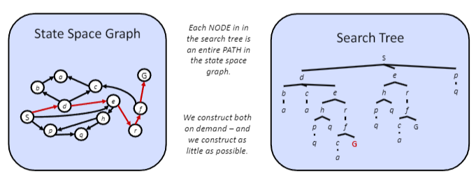
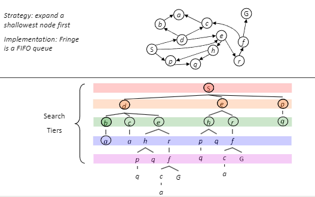
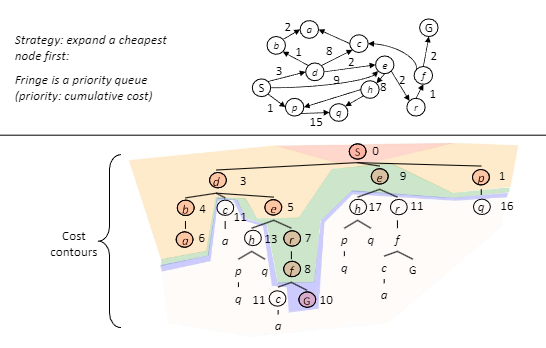
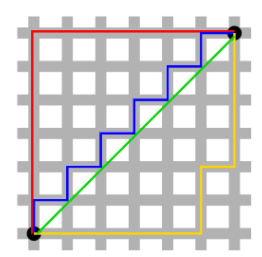

# 차례
- [차례](#차례)
- [들어가기 전에](#들어가기-전에)
- [인공지능 기초](#인공지능-기초)
  - [기계학습(Machine Learning)](#기계학습machine-learning)
  - [손실함수(Loss Function)](#손실함수loss-function)
  - [기계학습의 종류](#기계학습의-종류)
- [탐색 문제(Search Problem)](#탐색-문제search-problem)
  - [에이전트(Agent)](#에이전트agent)
  - [상태 그래프와 탐색 트리](#상태-그래프와-탐색-트리)
  - [탐색 알고리즘](#탐색-알고리즘)
  - [프린지(Fringe)](#프린지fringe)
  - [Uninformed Search](#uninformed-search)
    - [깊이 우선 탐색(DFS)](#깊이-우선-탐색dfs)
      - [DFS의 복잡도](#dfs의-복잡도)
    - [너비 우선 탐색(BFS)](#너비-우선-탐색bfs)
      - [BFS의 복잡도](#bfs의-복잡도)
    - [Iterative Deepening](#iterative-deepening)
    - [UCS](#ucs)
      - [UCS의 복잡도](#ucs의-복잡도)
  - [Informed Search](#informed-search)
    - [휴리스틱(Heuristics)](#휴리스틱heuristics)
      - [Relaxation](#relaxation)
    - [그리디 탐색(Greedy Search)](#그리디-탐색greedy-search)
    - [A\* 알고리즘](#a-알고리즘)
      - [Admissibility](#admissibility)
      - [Dominance](#dominance)
      - [Consistency](#consistency)
- [정리](#정리)


# 들어가기 전에
> 이 글은 컴퓨터학과 이중전공생으로서 배운 것들을 다시 한번 정리하고자 남기는 글입니다. 불완전한 기억 등의 이유로 오류가 있을 수 있으며, 참조 내지 이정표로만 사용해주세요.  
> 본 게시글은 고려대학교의 *인공지능* 강의를 기반으로 작성자의 추가적인 설명이 덧붙여진 글입니다. 또한 해당 강의는 UC 버클리 CS188을 기반으로 함을 밝힙니다.  

# 인공지능 기초
*(사실 난 사정 상 첫 시간에 강의를 못 가서 이 내용을 거의 듣지 못했다. 기초적이면서도 중요한 내용이라 스스로 훑어보는 정도에서 그침.)*

## 기계학습(Machine Learning)
기계학습, 즉 머신러닝은 쉽게 말해 데이터와 출력에서 프로그램을 만들어내는 과정이다. 예를 들어보자. 입력 `1`, `2`, `3`에 대해 각각 `2`, `3`, `4`가 출력으로 주어진다고 한다면, 어떤 프로그램이 필요할까? 바로 1을 더하는 프로그램일 것이다. 이처럼, 주어진 입출력에서 알맞은 프로그램이나 수식을 찾아내는 것이 머신러닝의 과정이다.  

몇 가지 용어를 짚고 넘어가자.  
- $$X$$: Input, Covariates, Predictors, Independent Variables, Feature, ... 모두 같은 것을 가리킨다.
- $$Y$$: Output, Labels, Dependent Variables, Responsive Variables, ...
- 모델(모형)이란 결국 $$f: X \to Y$$인 함수를 가리킨다.

풀어서 말하자면, 기계학습 모형은 입력에 따라 올바른(혹은 오차가 적은?) 출력을 내놓는 함수를 의미한다는 것이다.  

참고로, 저명한 교수 Tom Mitchell은 기계학습에 대해, 작업 T에 대해, 경험 E에 기반해서 성능 P를 개선하는 과정이라고 하기도 했다.  

## 손실함수(Loss Function)

모형의 성능을 측정하기 위한 지표가 되는 함수이다. 다른 이름으로 목적 함수(Objective Function)이라고도 한다. 사람 식으로 말하자면, 모델이 시험 봤을 때의 점수(혹은 감점된 점수)를 의미한다고 생각할 수 있다.  

## 기계학습의 종류

- 지도학습(Supervised): 데이터에 정답(레이블)이 존재하는 경우다. 쉽게 말해서 모의고사 보는 거랑 비슷한 건데, 문제를 풀고 거기에 대한 답지가 있어서 내가 맞춘 문제와 틀린 문제를 알 수 있다는 것을 의미한다.
  - 회귀(Regression): $$x \in \R^d$$이고, $$y \in \R$$이 주어졌을 때 사용한다. 갑자기 나온 이상한 수식이 당황스러운 분들을 위한 설명: 입력이 실수(Real Number)로 이루어져 있고, 마찬가지로 실수(Real Number) 정답이 주어지는 경우를 의미한다. 실수라는 말도 어려우면 그냥 숫자라고 생각해도 된다.
  - 분류(Classification): 입력은 마찬가지로 실수지만, 정답 $$y$$가 카테고리형인 경우 사용한다. 예를 들어 집값 예측은 결과값이 가격(숫자)이므로 회귀지만, 스팸메일 분류는 결과값이 예/아니오의 카테고리이므로 분류에 해당한다.
- 비지도학습(Unsupervised): 데이터가 라벨링되지 않은 경우, 즉 정답이 뭔지 모르는 경우다. 대표적으로 군집화(Clustering)가 있는데, 쉽게 얘기해 입력 값들을 비슷한 것끼리 모으는 것을 의미한다.
- 준지도학습(Semi-Supervised): 데이터가 일부만 라벨링된 경우이다.
- 강화학습(Reinforcement): 연속된 상태와 가능한 행동이 주어지고, 보상을 통해 학습하는 방식이다. 말이 어려운데, 게임 같은 걸 플레이하는 인공지능이 주로 여기에 속한다고 보면 된다.

이런 내용이 중심이 되는 수업은 아니라서 기초적인 부분은 이쯤 알면 되지 싶다. 

# 탐색 문제(Search Problem)

탐색(Search)이란, 흔히 BFS니 DFS니 할 때의 그 Search를 의미한다. 그래서 후술하겠지만 탐색 문제에 대해 접근할 때는 머릿속에 그래프나 트리를 그려두고 있으면 이해가 편하다. 탐색 문제는 크게 세 가지로 이루어진다.  

1. 상태 공간: 쉽게 말해서 가능한 모든 경우의 수.
2. 다음수 함수: 쉽게 말해서 현재 상태에서 일어날 수 있는 경우의 수.
3. 시작 상태와 목표 상태.

그래프 탐색이라고 한다면, 1은 노드, 2는 간선, 3은 시작 노드와 목표 노드라고 할 수 있다.  

팩맨을 예로 들어보자. 상태 공간이란 팩맨 게임의 가능한 모든 상태를 의미한다. $$3 \times 3$$ 형태의, 음식과 팩맨만이 존재하는 정사각형 공간에서, 가능한 경우의 수는 아래와 같이 말할 수 있다.  

1. 팩맨의 위치 $$9$$가지 경우의 수.
2. 각 칸에 음식이 존재하는지의 여부 $$2^9$$가지.
    - 조금 더 명확하게는 팩맨이 있는 칸을 제외하고 $$2^8$$가지.

즉, 이 경우 가능한 경우의 수(노드의 개수)는 $$9 \times 2^8 = 2304$$가지라고 할 수 있다. 이게 바로 상태 공간이 된다. 물론, 유령이나 캡슐 등 다른 변수, 또는 가능한 행동과 상태의 종류를 어떻게 정의하느냐에 따라 이 경우의 수는 변할 것이다.  

그렇지만, 한 상태에서 2300여개의 모든 상태로 이동할 수는 없다. 예를 들어, 팩맨이 정가운데에 있다면, 그 다음 팩맨의 위치는 정지, 상, 하, 좌, 우의 5가지 중 하나여야 할 것이다. 팩맨이 동에 번쩍 서에 번쩍 순간이동을 할 수는 없는 노릇이니... 그리고 음식의 여부 또한 새로 생겨날 수 없고, 팩맨이 먹지 않는 한 갑자기 사라질 수도 없으니 고정적이다. 따라서, 현재 상태 직후의 상태는, 많아봐야 5가지로 한정된다고 할 수 있다.  

## 에이전트(Agent)
이 경우, 팩맨을 조종하는 인공지능을 의미한다. 크게 두 가지 에이전트를 다룰 것이다.  

- Reflex Agent: 현재의 상황(혹은 거기에 더해 이전 상황까지의 메모리)에 따라 행동을 결정하며, 행동 이후의 상황이나 결과는 고려하지 않는다.
- Planning Agent: 행동의 결과를 예측하고, 이에 기반해서 자신의 선택을 결정한다.

단순히 현재 상황만 생각해서 최선의 선택을 고르는 에이전트는 Reflex Agent이고, 내 선택에 따라 상대의 선택이 어떻게 변할지를 고려해서 최선의 선택을 하는 게 Planning Agent라 할 수 있다.

## 상태 그래프와 탐색 트리

전술한 것처럼, 탐색을 위한 경우의 수를 그래프 형태로 나타내면 이해가 빠르다. 이때, 경우의 수를 일반적인 그래프 형태로 표현할 수도 있고, 탐색 트리의 형태로 표현할 수도 있다.  
*(그래프와 트리의 기초에 대해서는 알고 있으리라 생각하겠다. 궁금하다면 구글에 검색해보거나 추후 올라올 이산수학, 자료구조 강의 복습 등을 기다리시길.)*  

  
위 그림은 S 노드에서 G 노드로 가는 경우의 상태 그래프와 탐색 트리이다. 상태 그래프는 일종의 지도라고 할 수 있고, 탐색 트리는 가능한 다음 경우의 수들을 나타낸 분기를 그려낸 것이라 할 수 있다.  

- 상태 그래프: 각 경우의 수(상태 공간)가 노드, 경우의 수 간 가능한 변화가 간선으로 존재하는 그래프이다.
- 탐색 트리: 초기 상태를 루트 노드로 가지고, 각 노드의 자식 노드는 가능한 다음 경우의 수들이 되는 트리 형태의 그래프이다.

어떤 그래프에 루프가 존재하는 경우, 상태 그래프는 유한하더라도 탐색 트리는 무한해질 수 있다. 탐색 트리는 같은 상태(즉, 같은 노드)가 여러 번 나올 수 있기 때문이다.  

## 탐색 알고리즘

탐색 알고리즘은 말 그대로 탐색 문제를 해결하는 알고리즘이다.  
그래프(또는 상태 공간과 그 사이의 연결)가 주어졌을 때, 시작 상태에서 목표 상태로 이동하는 경로를 탐색하는 문제인데, 탐색 알고리즘의 아래 두 특성에 대해 생각해보자.

- 완전성(Completeness): 해답이 있는 문제에 대해서, 언젠가는 해답을 찾을 수 있다는 것을 보장해야 함.
- 최적성(Optimality): 찾은 경로가 최적의 경로, 즉 가장 비용이 적은 경로임을 보장해야 함.

## 프린지(Fringe)

탐색 문제에서 프린지란, 쉽게 말해 탐색 대상인 노드들이 들어있는 자료구조를 의미한다. 영단어 Fringe는 가장자리 내지는 경계선이라는 뜻이 있는데, 탐색 트리에서 맨 아래 노드(터미널 노드)들이 프린지에 해당한다는 점을 생각해보면 퍽 재미있는 이름이다.  

프린지를 어떤 자료구조로 선택하느냐에 따라서, 탐색 알고리즘의 종류가 바뀐다. 일반적으로 탐색 알고리즘은 아래 파이썬 스타일의 수도코드와 같이 작동한다.  

```python
while fringe:
  # fringe의 종류에 따라 어떤 노드가 pop되는지 다르다.
  current_node = fringe.pop()
  if current_node == goal_node:
    return solution
  else:
    fringe.extend(current_node.next_nodes)
return failure
```

스포일러를 하자면, 프린지가 LIFO 스택이면 DFS, FIFO 큐면 BFS, 우선순위 큐면 UCS가 된다.  

## Uninformed Search

탐색 방법이 Uninformed라는 건 말 그대로 정보가 없다는 것을 의미한다. 문명 같은 게임의 소위 *전장의 안개*를 생각해보자. 내가 직접 탐색하기 전에는 지도가 어떻게 생겼는지 알 수가 없다. 미로찾기를 한다고 했을 때, 내가 미로 안에 있어서, 다음 길이 어떻게 생겼는지 모르는 것, 그게 Uninformed Search이다.  
반면, 나중에 다룰 Infromed Search는 전체 지도를 들고 시작하는 미로찾기라고 생각하면 된다.  

### 깊이 우선 탐색(DFS)

알고리즘 공부를 하면 알 수밖에 없는 DFS는 위의 탐색 알고리즘에서 프린지가 스택인 경우, 즉, 가장 최근에 프린지에 들어온 노드가 가장 먼저 탐색되는 경우(LIFO)에 해당한다.  
탐색 트리를 상상해 보라. DFS의 탐색 트리는 우선 한 길을 계속 파고든 뒤에, 막히면 다시 올라가서 다른 길을 찾는 방식으로 이루어진다.  


DFS의 완전성(Completeness)을 보장할 수 있는가? 탐색 트리가 유한하다면 그렇다. 그렇지만 알고리즘 문제를 풀 때처럼 `visited` 배열 같은 걸 만들어두지 않으면 루프에서 빠져나오지 못하게 되고, 이 경우 탐색 트리는 무한하므로 완전하지 않다.  
DFS의 최적성(Optimality)은 어떤가? 보장할 수 없다. 답을 찾는 순간 종료한다는 가정 하에, DFS는 최좌측(Leftmost)의 답을 찾게 되고, 우측에 더 저비용의 해답이 있다고 해도 이를 발견할 수 없다.

#### DFS의 복잡도

DFS의 복잡도는 어떨까?  

- 최대 자식 노드의 개수를 $$b$$개
- 트리의 최대 레벨을 $$m$$

이라고 한다면,  

- 시간 복잡도: 최악의 경우 해답까지의 모든 노드를 뒤지게 되므로 $$O(b^m)$$
- 공간 복잡도: 프린지에 모든 노드를 저장할 필요가 없고, 답을 찾을 때까지 방문한 모든 노드의 형제 노드(Siblings)만 저장하면 되므로, $$O(bm)$$

### 너비 우선 탐색(BFS)

프린지가 FIFO 큐, 즉 선입선출이 지켜지는 자료구조인 경우 탐색 알고리즘은 BFS가 된다. 탐색 트리를 좌에서 우로 훑는 DFS와 다르게, BFS는 탐색 트리를 위에서 아래로 훑는다.  



BFS의 완전성(Completeness)은 어떤가? 항상 완전하다. 어떤 해답이 존재한다면, 그 해답은 반드시 트리 안에서 루트에서 출발하여 유한한 단계 안에 도착할 수 있는 위치에 존재할 것이고, 따라서 BFS는 언젠가는 정답을 찾는다.  
BFS는 최적(Optimal)인가? 마찬가지로 최적이다. 다만, 모든 간선의 비용이 동일한 경우에만 그렇다. 간선이 비용이 같다는 전제 하에, 탐색 트리에서 위쪽에 존재한다는 말은 비용이 적다는 말과 동치이기 때문이다.  

#### BFS의 복잡도

BFS의 복잡도는 아래와 같다.  

- 최대 자식 노드의 개수를 $$b$$개
- 정답이 존재하는 레벨(트리의 레벨이 아니다)을 $$s$$

라고 할 때,  

- 시간 복잡도: 해답이 있는 레벨 아래의 노드는 확인할 필요가 없으므로 $$O(b^s)$$
- 공간 복잡도: 해답이 있는 레벨($$s$$레벨)의 노드 전체를 저장해야 하므로 $$O(b^s)$$

### Iterative Deepening

BFS는 최적해를 찾고, DFS는 메모리 효율성이 좋다. 이 두 방법을 적당히 취한 방법이 바로 Iterative Deepening(내지는 Iterative Deepening Search)이다.  
우선, 탐색 트리의 깊이를 제한한다. 예를 들어 탐색 트리의 깊이를 1로 제한하고 DFS를 수행한다. 해답이 나오지 않으면 탐색 트리의 깊이를 2로 제한하고 다시 DFS를 수행한다. 이렇게 깊이 제한을 늘려가면서 DFS를 수행하면, 완전성과 최적성은 당연히 보장되고, 공간 복잡도도 DFS와 같으므로 두 방법의 장점을 적절히 취할 수 있다.  
다만, Iterative(반복적)라는 이름처럼, 이 방법은 깊이가 제한된 DFS를 최대 $$s$$번 수행하기 때문에, 일견 비효율적인 부분이 있다. 그럼에도 불구하고, 각 DFS의 탐색 트리 크기가 원래 트리보다 훨씬 작기 때문에, 효율적으로 답을 찾아낼 수 있다.  

### UCS

앞서 살펴본 BFS와 Iterative Deepening을 활용한 DFS는 최적해를 찾음을 보장하지만, 그 전제 조건은 간선의 비용이 모두 동일할 것이었다. 팩맨 같은 게임이야 어느 방향으로 움직이든 비용이 동일하다고 생각할 수도 있겠지만, 현실의 많은 문제는 모든 선택의 비용이 동일하지 않다.  
이럴 때는 최소 비용으로 움직이는 방법, 즉 알고리즘에서 말하는 최단 거리 탐색 알고리즘을 사용해야 한다. UCS(Uniform Cost Search)라는 이름은 어렵게 느껴질 수 있지만 사실 다익스트라 알고리즘에 다름 아니다. 구체적으로는, 이 수업에서 다루는 DFS, BFS, UCS는 해답(목적지에 도달하는 방법)을 찾으면 바로 종료하지만, 백준과 같은 일반적인 알고리즘 문제의 DFS, BFS, 다익스트라는 전체 탐색을 목표로 한다는 정도의 차이만 있을 뿐이다. 즉, UCS는 목적지 노드가 하나로 정해진 다익스트라 알고리즘이다.  

  
위 UCS의 탐색 트리는, 코스트에 따라 일종의 등고선(Contour)이 존재함을 알 수 있다. UCS는 프린지를 우선순위 큐(Priority Queue)로 구성한 탐색 알고리즘이고, 다익스트라 알고리즘과 같은 알고리즘이기 때문에 해답이 유한한 곳에 있고 음수 간선이 없다는 가정 하에 완전하고 최적이다.  
참고로, UCS는 BFS를 간선의 비용이 모두 같지 않은 경우까지 일반화한 것과 같으므로, 간선의 비용이 모두 같은 상황에선 BFS와 같다.  

#### UCS의 복잡도

UCS의 복잡도는 주로 아래의 관점에서 다루어진다.  

- 최대 자식 노드의 개수가 $$b$$개
- 최적 해답의 비용은 $$C^*$$
- 최소 간선의 비용은 $$\epsilon$$
- 따라서 대략적인 깊이는 $$C^* \over \epsilon$$

이라고 할 때,  

- 시간 복잡도: BFS의 $$O(b^s)$$에서 $$s={C^* \over \epsilon}$$인 케이스이므로, $$O(b^{C^* \over \epsilon})$$
- 공간 복잡도: 시간복잡도와 마찬가지로 BFS의 경우에 비추어 $$O(b^{C^* \over \epsilon})$$

## Informed Search

앞서 Uninformed Search는 지도가 없어서 일일히 탐험해서 목적지를 찾아야 되는 경우이고, Informed Search는 이미 지도가 있어서 직접 가지 않고도 목적지까지의 최단거리를 찾을 수 있는 방법이라고 했다.  
당연하지만 목적지까지의 정보가 이미 존재하는 Informed Search가 더 효율적이다.  

### 휴리스틱(Heuristics)

특정 상태가 목표 상태와 얼마나 가까운지 대략적으로 계산하는 방법을 의미한다. 쉽게 말해 일종의 어림잡기인데, 일상 속에서 *버스 안에 골프공을 얼마나 채울 수 있느냐*라는 질문 해결을 위해 대략적으로 버스의 용량과 골프공의 크기를 가늠하는 방식이 바로 휴리스틱이다.  
아무튼, 휴리스틱에서 우리가 가져야 하는 느낌은 바로, 대략적인 답을 빠르게 어림잡는다는 부분이다. 당연하지만 이 답은 정확하진 않고, 따라서 최적도 아니다.  

팩맨이 움직이는 문제에서, 목적지를 알고 있다면 세울 수 있는 휴리스틱 방법론 중 하나는 바로 (팩맨과 목적지 사이의 벽이나 장애물을 고려하지 않은) 거리이다.  
가장 간단하고 직관적인 거리는 바로 유클리드 거리(Euclidian Distance)이다. 수학시간에 거리를 구하는 바로 그 방법($$\sqrt{\sum\limits_{i=0}^{n} (p_i - q_i)}$$)이다.  
하지만, 생각해보면 팩맨은 상하좌우로만 움직일 수 있지 유클리드 거리처럼 대각선으로 움직일 수는 없다. 따라서 상하좌우 격자를 따라서만 움직일 수 있다고 가정할 때의 거리를 구할 수도 있는데, 그 모습이 마치 대도시의 자동차들이 움직이는 것과 비슷해서 맨해튼 거리(Manhattan Distance)라고 한다. 맨해튼 거리는 $$\sum\limits_{i=0}^{n}|p_i - q_i|$$인데, 즉 가로 방향 거리랑 세로 방향 거리를 그냥 더한 값이다.  

서울에서 부산까지 가는 최적의 거리를 구한다고 하자. 둘 사이의 직선 거리가 바로 유클리드 거리고, 둘 사이의 위도 차이, 경도 차이를 더한 것이 맨해튼 거리이다. 실제로는 도로를 따라 움직여야 하므로 *유클리드 거리 <= 맨해튼 거리 <= 실제 거리*라는 공식이 성립할 것이다.  

  
위 이미지에서 대각선으로 움직인 녹색 선의 길이가 바로 유클리드 거리이고, 격자를 따라 움직인 나머지 선들의 길이(모두 같음)가 바로 맨해튼 거리이다.  

#### Relaxation

위 거리 휴리스틱을 자세히 들여다보면, 실제로 팩맨이 움직여야 하는 거리는 휴리스틱으로 구한 값보다 길면 길었지, 절대 짧을 수 없다는 것을 알 수 있다. 왜냐하면 위의 휴리스틱 자체가 팩맨과 목적지 사이에 아무런 장애물이 없다고 가정했을 때의 거리인데, 실제로는 장애물이 있을 수도 있기 때문이다.  
즉, 이러한 휴리스틱은 일부 제약조건을 무시하고 계산한 값이기 때문에, 최적해의 하한값(Lower Bound)를 의미하게 된다. 즉, 실제로는 아무리 잘해 봐야 휴리스틱으로 구한 비용보다 더 효율적일 수는 없다는 것이다.  
따라서 유클리드 거리와 맨해튼 거리는 실제 문제에 대한 답이 아니라, 일부 제약사항을 무시한 문제(Relaxed Problem)에 대한 해답이 되는 것이다.  

### 그리디 탐색(Greedy Search)

그리디 탐색이란 말 그대로 그리디 알고리즘에 따라 탐색하는 것을 의미한다. 그리디 탐색의 동작은 단순하다. 매 순간 휴리스틱으로 구한 비용이 제일 작아지는 경우의 수를 선택한다. 그 답은 운이 좋다면 최적이지만, 운이 없다면 답만 빼놓고 모든 길을 다 가보고 마지막에서야 목적지를 발견할 수도 있다. 즉, 최악의 경우 DFS, 그것도 최악의 DFS와 같은 효율성을 지닌다.  

### A* 알고리즘

휴리스틱의 그리디 탐색과 UCS를 적절하게 섞은 방법이다. 구체적으로는 휴리스틱으로 구한 비용 $$h(n)$$과 UCS로 구한 비용 $$g(n)$$을 더해서 최종 비용 $$f(n)$$으로 취급하는 함수이다. 즉, A* 알고리즘은 그리디 탐색과 UCS를 더한 것이다.  

참고로, A* 알고리즘으로 해를 구할 때는 반드시 목적지를 프린지에서 꺼낼 때 종결해야 한다. 휴리스틱으로 구한 값이 최적이 아닐 수 있기 때문.  

A* 알고리즘 역시 최적임이 보장되지 않는다. UCS로 구한 $$g(n)$$은 최적이지만 휴리스틱으로 구한 $$h(n)$$은 최적이 아니기 때문이다. 하지만, 후술할 Admissibility가 전제된다면 A* 알고리즘은 최적임이 보장된다.  

#### Admissibility

어떤 휴리스틱이 Admissible하다는 것은 $$0 \le h(n) \le h^*(n)$$을 만족한다는 것을 의미한다. 이때 $$h^*(n)$$은 실제 비용을 의미한다. 즉, Admissible Heuristic이란 휴리스틱으로 구한 비용이 항상 실제 비용보다 작아야 된다는 의미이다.  
앞서서 Relxation에서 한 이야기랑 같은 맥락인데, 휴리스틱으로 구한 비용이 실제 비용보다 커지면 최적해가 최적이 아닌 해보다 나중에 프린지에서 나오게 될 수가 있고, 그럼 A* 알고리즘의 최적성을 보장할 수가 없게 된다.  

그렇다면 Admissibility가 전제된다면 A* 알고리즘이 최적임은 어떻게 보장할 수 있는가? 

1. 최적해 A와 최적이 아닌 해 B가 있다고 하자.
2. 우리는 A가 항상 B보다 프린지에서 먼저 나온다는 것을 증명하면 된다.
3. 프린지 안에 A와 B가 모두 있는 상태라면, $$g(A) < g(B)$$이고 $$h(A) = h(B) = 0$$이므로 A가 프린지에서 먼저 나온다.
4. A의 모든 조상 노드가 B보다 먼저 프린지에서 나온다면, B가 프린지에서 나오기 전에 A가 프린지로 들어가고, 따라서 3번에 의해 A가 B보다 먼저 나온다는 것을 증명할 수 있다.
5. 그런데 휴리스틱 $$h$$는 Admissible한데, 이를 수식으로 나타내자면 A의 조상 노드 $$n$$에 대해, $$f(n) \le g(A)$$라고 할 수 있다.
6. 그런데 전술했듯 $$g(A) < g(B)$$이므로 $$f(n) \le g(A) < g(B)$$이다.
7. 따라서 A를 포함한 모든 A의 조상 노드는 최적해가 아닌 B보다 먼저 프린지에서 나온다.

#### Dominance

여러 개의 Admissible Heuristics를 `max`를 이용해서 결합해도 여전히 Admissible하다. 이는 증명이 필요 없을 정도로 자명하다.  

두 개의 Admissible한 휴리스틱 $$h_a$$와 $$h_b$$에 대해, 모든 $$n$$에 대해 $$h_a(n) \ge h_b(n)$$이라면 $$h_a$$가 $$h_b$$를 Dominate한다고 한다.  
이게 무슨 말인가 싶을 수 있는데, 두 휴리스틱은 Admissible하므로 실제 비용보다는 적은 비용을 산출한다. 그런데 $$h_a$$가 $$h_b$$보다 항상 크다는 것은 $$h_a$$가 $$h_b$$보다 항상 실제 비용에 가깝다는 것을 의미한다. 즉, $$h_a$$는 $$h_b$$보다 더 좋은 휴리스틱이다.  

극단적으로, 모든 경우 $$h(n) = 0$$인 휴리스틱을 상상해 보자. 사실 이 경우 A* 알고리즘은 UCS와 같다. $$f(n) = h(n) + g(n)$$인데, $$h(n) = 0$$이므로 $$f(n) = g(n)$$이기 때문이다. 즉, Informed Search의 이점을 전혀 살리지 못하고 있는 셈이다.  
반면, 모든 경우 $$h(n) = h^*(n)$$인 휴리스틱, 즉 모든 경우 실제 비용을 산출하는 휴리스틱을 상상해 보자. 이 경우 우리는 바로 정답을 향해 갈 것이다. 즉 이 경우 A* 알고리즘은 전지적인 알고리즘이다.  
일반적인 휴리스틱은 그 사이에 있을 것이며, 즉 휴리스틱의 이점을 다소간 사용해서, Uninformed Search인 UCS보다는 더 빠르게 해답을 찾을 것이다.  

#### Consistency

이전에 언급한 것처럼, 사실 탐색 트리에 기반한 탐색은 중복된 노드를 계속 살펴보게 된다. 이를 방지하기 위해 `visited` 배열처럼 방문한 노드들의 목록을 저장하는 자료구조를 사용할 수 있는데, 이를 Graph Search라고 할 수 있다. 용어에 현혹되지 말자. 지금까지의 탐색은 같은 노드를 여러 번 방문할 수도 있는(사실 좀 비효율적인) 탐색이었고, 여기서 Graph Search라는 용어는 같은 노드를 다시 방문하지 않는 탐색 방법을 의미할 뿐이다.  

그렇지만, 이미 방문한 노드를 다시 방문하지 않는다(Graph Search)는 조건이 있을 때, A* 알고리즘의 최적성은 보장되지 않는다. 왜냐하면 최적해의 비용 $$f(A)$$는 UCS의 비용 $$g(A)$$와 같다는 게 보장되지만, 거기까지 가기 위한 다른 노드의 비용 $$f(A)$$는 사실 휴리스틱이 가미된 추정값이기 때문이다. 이전에 구한 중간 비용은 정확하지 않은 값인데, 새로 구한 중간 비용으로 갱신이 필요한 상황에서도 Graph Search는 이미 방문한 노드를 갱신하지 않기 때문에, A* 알고리즘의 최적성이 훼손된다.  

이때는, 휴리스틱의 일관성(Consistency)이 갖춰져야만 A* 알고리즘이 최적이라고 할 수 있다. 그렇다면 Consistency란 무엇인가? 두 노드 $$n$$, $$m$$에 대해, $$h(n) - h(m)$$이 실제 $$n$$에서 $$m$$까지 가는 비용보다 작거나 같아야 된다는 것을 의미한다.  
즉, Consistency는 Admissibility를 조금 더 일반화한 것인데, $$m$$이 목적지일 때의 Consistency가 바로 Admissibility이기 때문이다. 즉, 정리하자면 아래와 같다.  

- Admissibility: 휴리스틱이 항상 목적지까지의 비용을 과대평가하지 않는다.
- Consistency: 휴리스틱이 항상 다른 노드까지의 비용을 과대평가하지 않는다.

당연히, Consistency는 Admissibility를 내포하므로, Consistent한 휴리스틱은 Admissible하다.  

# 정리

이번 게시글에서는 [인공지능의 기초](#인공지능-기초)에 대해서 간략하게 살펴보고, [탐색 문제](#탐색-문제search-problem)를 해결하기 위한 [Uninformed Search](#uninformed-search)와 [Informed Search](#informed-search)에 대해 알아보았다.  

이후에는 적대적 게임, Minimax, Expectimax 등에 대해서 알아보도록 하겠다.